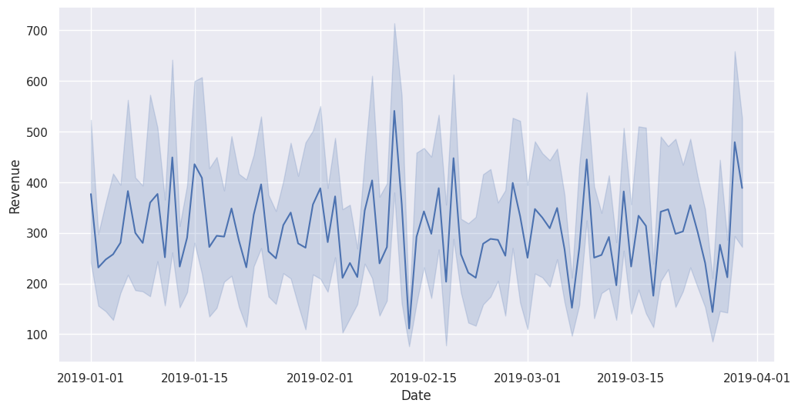

# PandasAI Visualization Project in Google Colab

## Overview
This project demonstrates how to create data visualizations using PandasAI within a Google Colab environment. It showcases the power of combining pandas for data manipulation with AI-assisted visualization techniques.

## Features
- Data preprocessing using pandas
- AI-assisted visualization creation with PandasAI
- Implementation in Google Colab for easy accessibility and collaboration

## Requirements
- Google Colab account
- Python 3.x
- PandasAI library

## Installation
Provide instructions on how to set up the project in Google Colab, including any necessary Python Install Package (pip).
```sh
!pip install pandasai
```

## Usage
Explain how to use your notebook, including:
1. How to load the data
2. Key functions or cells for creating visualizations
3. Examples of visualizations that can be created

## Example Visualizations

Here are some sample visualizations created by this project:

<table>
  <tr>
    <td></td>
    <td>This line chart displays daily revenue trends over a three-month period, showing fluctuations and patterns in sales performance.</td>
  </tr>
  <tr>
    <td></td>
    <td>This bar chart compares the total revenue generated by different payment methods, including cash, credit card, and e-wallet transactions.</td>
  </tr>
  <tr>
    <td></td>
    <td>This pie chart illustrates the distribution of revenue across various payment types, providing a clear breakdown of the percentage contribution of each method.</td>
  </tr>
</table>

These visualizations were generated using PandasAI in our Google Colab notebook. They demonstrate the capability of our project to create insightful and visually appealing data representations.
